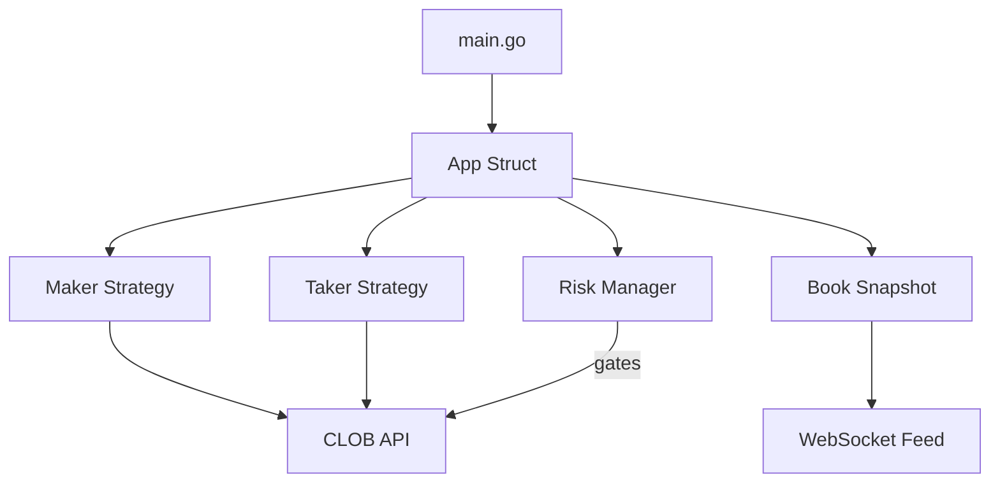

# Polymarket Trader

[](https://github.com/GoPolymarket/polymarket-trader/actions)
[](https://pkg.go.dev/github.com/GoPolymarket/polymarket-trader)
[](https://opensource.org/licenses/Apache-2.0)

An automated trading bot for the Polymarket CLOB, built on top of [polymarket-go-sdk](https://github.com/GoPolymarket/polymarket-go-sdk). Designed for volume generation to qualify for the Polymarket Builder Program grant.

## Features

- **Market Making** — Quotes two-sided markets with configurable spread and size
- **Signal Taker** — Detects order book imbalances and takes directional positions
- **Risk Management** — Three-gate system: max open orders, daily loss limit, per-market position cap
- **Conservative Safeguards** — Daily loss % guardrail and consecutive-loss cooldown
- **Paper Trading Mode** — Virtual account execution with real orderbook data
- **WebSocket-Driven** — Reacts to real-time L2 order book events
- **Builder Attribution** — Integrates builder auth headers for grant/leaderboard credit
- **Dry-Run Mode** — Test strategies without placing real orders
- **Auto Market Selection** — Automatically picks the most liquid markets

## Architecture



| Package | Description |
|---------|-------------|
| `cmd/trader` | Entry point — config loading, SDK client setup, signal handling |
| `internal/app` | Core trading loop (`App.Run`, `HandleBookEvent`, `Shutdown`) |
| `internal/config` | YAML + env configuration with sensible defaults |
| `internal/feed` | Thread-safe order book snapshot cache |
| `internal/risk` | Three-gate risk manager (orders, PnL, position) |
| `internal/strategy` | Maker (quote computation) and Taker (imbalance detection) strategies |

## Quick Start

### Prerequisites

- Go 1.25+
- For `live` mode: Polymarket account with API credentials
- (Optional) Builder Program credentials

### Setup

```bash
git clone https://github.com/GoPolymarket/polymarket-trader.git
cd polymarket-trader
cp .env.example .env
# Edit .env with your credentials
```

### Run in Dry-Run Mode (recommended first)

```bash
# Using make
make run

# Or directly
go run ./cmd/trader/ -config config.yaml
```

### Run Live

Set `TRADER_DRY_RUN=false` in your `.env` or `dry_run: false` in `config.yaml`.

### Staged Rollout (recommended)

Use the built-in rollout presets to move from paper to small live safely:

```bash
# 1) Paper fills with virtual balance
./scripts/rollout.sh paper

# 2) Live connectivity but no real orders
./scripts/rollout.sh shadow

# 3) Small live caps (maker/taker size and risk clamped)
./scripts/rollout.sh live-small

# 4) Full live (uses your config values)
./scripts/rollout.sh live
```

Equivalent CLI flags:

```bash
go run ./cmd/trader -config config.yaml -phase live-small
# Optional explicit mode override:
go run ./cmd/trader -config config.yaml -mode paper
```

## Configuration

Startup performs config validation and exits fast on invalid critical values (mode, paper fee/slippage, key risk percentages).

### config.yaml Reference

| Field | Type | Default | Description |
|-------|------|---------|-------------|
| `scan_interval` | duration | `10s` | Interval between market scans |
| `dry_run` | bool | `true` | Log trades without executing |
| `trading_mode` | string | `paper` | Execution backend (`paper` or `live`) |
| `log_level` | string | `info` | Log verbosity |
| `builder_sync_interval` | duration | `10m` | Builder volume/leaderboard refresh interval |
| **Maker** | | | |
| `maker.enabled` | bool | `true` | Enable market making |
| `maker.markets` | []string | `[]` | Token IDs to trade (empty = auto-select) |
| `maker.auto_select_top` | int | `2` | Number of markets to auto-select |
| `maker.min_spread_bps` | float | `20` | Minimum spread in basis points |
| `maker.spread_multiplier` | float | `1.5` | Multiplier applied to market spread |
| `maker.order_size_usdc` | float | `1` | Order size in USDC |
| `maker.refresh_interval` | duration | `5s` | Quote refresh interval |
| `maker.max_orders_per_market` | int | `2` | Max orders per market |
| **Taker** | | | |
| `taker.enabled` | bool | `true` | Enable taker strategy |
| `taker.min_imbalance` | float | `0.15` | Minimum bid/ask imbalance to trigger |
| `taker.depth_levels` | int | `3` | Book depth levels to analyze |
| `taker.amount_usdc` | float | `1` | Trade size in USDC |
| `taker.max_slippage_bps` | float | `30` | Max slippage in basis points |
| `taker.cooldown` | duration | `60s` | Cooldown between trades per market |
| **Risk** | | | |
| `risk.max_open_orders` | int | `6` | Maximum concurrent open orders |
| `risk.max_daily_loss_usdc` | float | `0` | Optional fixed daily loss cap (0 disables fixed cap) |
| `risk.max_daily_loss_pct` | float | `0.02` | Daily loss cap as a fraction of account capital |
| `risk.account_capital_usdc` | float | `1000` | Baseline capital used for percentage-based limits |
| `risk.max_position_per_market` | float | `3` | Max USDC exposure per market |
| `risk.max_consecutive_losses` | int | `3` | Consecutive realized losing trades before cooldown |
| `risk.consecutive_loss_cooldown` | duration | `30m` | Cooldown window after max consecutive losses |
| **Paper** | | | |
| `paper.initial_balance_usdc` | float | `1000` | Starting virtual cash balance |
| `paper.fee_bps` | float | `10` | Simulated fee model in bps |
| `paper.slippage_bps` | float | `10` | Simulated slippage model in bps |
| `paper.allow_short` | bool | `true` | Allow synthetic short selling in paper mode |

Set `paper.allow_short: false` to enforce inventory checks before SELL fills in paper mode.

### Environment Variables

All credentials are loaded from environment variables (see `.env.example`):

| Variable | Description |
|----------|-------------|
| `POLYMARKET_PK` | Ethereum private key |
| `POLYMARKET_API_KEY` | CLOB API key |
| `POLYMARKET_API_SECRET` | CLOB API secret |
| `POLYMARKET_API_PASSPHRASE` | CLOB API passphrase |
| `BUILDER_KEY` | Builder program key |
| `BUILDER_SECRET` | Builder program secret |
| `BUILDER_PASSPHRASE` | Builder program passphrase |
| `TRADER_DRY_RUN` | Override dry-run mode (`true`/`1`) |
| `TRADER_TRADING_MODE` | Override mode (`paper`/`live`) |
| `TRADER_PAPER_ALLOW_SHORT` | Override paper shorting (`true`/`1` enables synthetic shorting) |
| `TRADER_BUILDER_SYNC_INTERVAL` | Override builder sync interval (Go duration, e.g. `30s`, `5m`) |

## Trading Strategies

### Maker

Computes two-sided quotes around the midpoint with a configurable spread. The spread is the larger of `min_spread_bps` or `market_spread * spread_multiplier`. Quotes are refreshed on every order book update.

### Taker

Evaluates order book imbalance across configurable depth levels. When `|bid_depth - ask_depth| / total_depth` exceeds `min_imbalance`, places a market order in the direction of the imbalance. A per-market cooldown prevents overtrading.

## Risk Management

Every order passes through conservative guardrails before execution:

1. **Order Count** — Blocks if `open_orders >= max_open_orders`
2. **Daily Loss** — Blocks if daily PnL breaches configured fixed or percentage cap
3. **Position Limit** — Blocks if `position + amount > max_position_per_market`
4. **Loss Streak Cooldown** — Blocks trading after `max_consecutive_losses` realized losses
5. **Emergency Stop** — Manual or drawdown-triggered global halt

An emergency stop flag can instantly halt all trading.
Startup validation fails fast on invalid risk bounds (for example non-positive `max_open_orders`, non-positive `risk_sync_interval`, or negative caps).
If Telegram notifications are enabled, the bot alerts on risk cooldown and also auto-sends daily/weekly coaching templates at UTC day boundaries (weekly on Monday UTC).

## Dashboard API

If `api.enabled=true`, the bot exposes runtime endpoints including:
- `GET /api/health` (liveness probe)
- `GET /api/ready` (readiness probe)
- `GET /api/status`
- `GET /api/pnl`
- `GET /api/perf` (performance KPIs: total PnL, PnL/fill, fees, net after fees)
- `GET /api/kpi` (canonical north-star board: `RAV30 = NetPnL30d * RiskCompliance30d * ExecQualityFactor30d * BuilderFactor30d`, plus funnel/risk/execution/builder process metrics and UTC data-hygiene metadata)
- `GET /api/coach` (actionable "make more, lose less" guidance: risk mode, size multiplier, and prioritized actions)
- `GET /api/sizing` (position sizing guidance from risk budget + historical edge, with market allocation weights)
- `GET /api/insights` (market-level scorecards + focus/deprioritize recommendations for where to allocate capital)
- `GET /api/alpha-manager` (strategy/market alpha governance with deweight/pause recommendations and lightweight A/B champion-challenger plan)
- `GET /api/growth-funnel` (unified PM growth funnel + north-star definitions across market discovery, fills, capital retention, and builder contribution)
- `GET /api/profiles` (productized presets for Builder volume, steady alpha, and research experimentation)
- `GET /api/ecosystem-playbook` (builder/grant ecosystem automation actions and submission pipeline steps)
- `GET /api/execution-quality` (execution loss decomposition + profit-uplift model + active optimization plan: clip multiplier, requote cadence, and priority action)
- `GET /api/telegram-templates` (Telegram-ready daily/weekly message templates with action priorities, risk hints, and daily profit-focus uplift summary; supports `?window=7d|30d`)
- `GET /api/daily-report` (daily diagnosis: why profit/loss happened, tomorrow risk mode, and prioritized next actions)
- `GET /api/stage-report` (grant evidence bundle with scorecard, KPI snapshot, strengths/risks, profit-uplift evidence, and verifiable `evidence_id` + `checksum_sha256`; supports `?window=7d|30d` and `?format=markdown|csv`)
- `GET /api/grant-package` (review-ready grant submission package: milestones, artifact index, profit case summary, and manifest checksum; supports `?window=7d|30d` and `?format=markdown`)
- `GET /api/grant-report` (single payload aggregating builder + risk + performance + readiness scorecard; add `?format=csv` for export)
- `GET /api/builder` (builder daily volume/leaderboard with counts, sync age, and health flags `never_synced`/`stale`)
- `GET /api/risk` (daily cap usage/headroom + `can_trade` and machine-readable `blocked_reasons`)
- `GET /api/paper` (paper balance, fees, shorting flag, inventory, realized/unrealized PnL, estimated equity)

## Docker Deployment

```bash
# Build and run
docker compose up -d

# Or build manually
make docker
docker run --env-file .env -v ./config.yaml:/config.yaml:ro polymarket-trader
```

## Builder Program

This bot integrates Polymarket's [Order Attribution](https://docs.polymarket.com/developers/builders/order-attribution) system. When builder credentials are configured, all orders include attribution headers that credit volume to your builder account for grant qualification.
You can tune builder dashboard refresh cadence with `builder_sync_interval` (default `10m`).

## Development

```bash
make test    # Run tests with race detector
make lint    # Run golangci-lint
make cover   # Generate coverage report
make build   # Build binary to bin/trader
make clean   # Remove build artifacts
```

## License

Apache-2.0 — see [LICENSE](LICENSE) for details.
