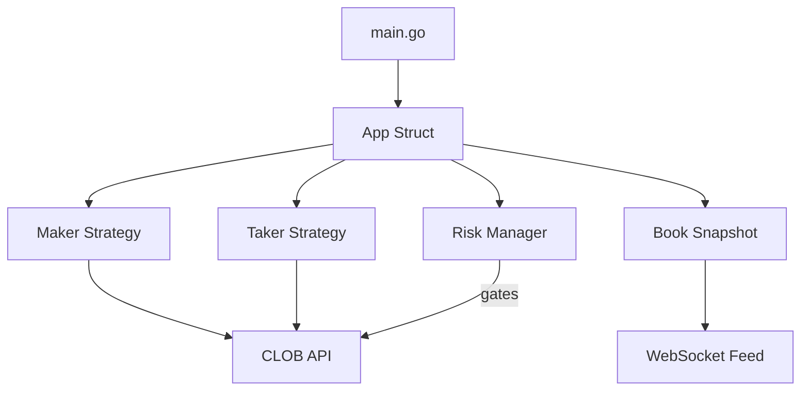

# Polymarket Trader

[](https://github.com/GoPolymarket/polymarket-trader/actions)
[](https://pkg.go.dev/github.com/GoPolymarket/polymarket-trader)
[](https://opensource.org/licenses/Apache-2.0)

An automated trading bot for the Polymarket CLOB, built on top of [polymarket-go-sdk](https://github.com/GoPolymarket/polymarket-go-sdk). Designed for volume generation to qualify for the Polymarket Builder Program grant.

## Features

- **Market Making** — Quotes two-sided markets with configurable spread and size
- **Signal Taker** — Detects order book imbalances and takes directional positions
- **Risk Management** — Three-gate system: max open orders, daily loss limit, per-market position cap
- **WebSocket-Driven** — Reacts to real-time L2 order book events
- **Builder Attribution** — Integrates builder auth headers for grant/leaderboard credit
- **Dry-Run Mode** — Test strategies without placing real orders
- **Auto Market Selection** — Automatically picks the most liquid markets

## Architecture



| Package | Description |
|---------|-------------|
| `cmd/trader` | Entry point — config loading, SDK client setup, signal handling |
| `internal/app` | Core trading loop (`App.Run`, `HandleBookEvent`, `Shutdown`) |
| `internal/config` | YAML + env configuration with sensible defaults |
| `internal/feed` | Thread-safe order book snapshot cache |
| `internal/risk` | Three-gate risk manager (orders, PnL, position) |
| `internal/strategy` | Maker (quote computation) and Taker (imbalance detection) strategies |

## Quick Start

### Prerequisites

- Go 1.25+
- Polymarket account with API credentials
- (Optional) Builder Program credentials

### Setup

```bash
git clone https://github.com/GoPolymarket/polymarket-trader.git
cd polymarket-trader
cp .env.example .env
# Edit .env with your credentials
```

### Run in Dry-Run Mode (recommended first)

```bash
# Using make
make run

# Or directly
go run ./cmd/trader/ -config config.yaml
```

### Run Live

Set `TRADER_DRY_RUN=false` in your `.env` or `dry_run: false` in `config.yaml`.

## Configuration

### config.yaml Reference

| Field | Type | Default | Description |
|-------|------|---------|-------------|
| `scan_interval` | duration | `10s` | Interval between market scans |
| `dry_run` | bool | `true` | Log trades without executing |
| `log_level` | string | `info` | Log verbosity |
| **Maker** | | | |
| `maker.enabled` | bool | `true` | Enable market making |
| `maker.markets` | []string | `[]` | Token IDs to trade (empty = auto-select) |
| `maker.auto_select_top` | int | `5` | Number of markets to auto-select |
| `maker.min_spread_bps` | float | `20` | Minimum spread in basis points |
| `maker.spread_multiplier` | float | `1.5` | Multiplier applied to market spread |
| `maker.order_size_usdc` | float | `25` | Order size in USDC |
| `maker.refresh_interval` | duration | `5s` | Quote refresh interval |
| `maker.max_orders_per_market` | int | `2` | Max orders per market |
| **Taker** | | | |
| `taker.enabled` | bool | `true` | Enable taker strategy |
| `taker.min_imbalance` | float | `0.15` | Minimum bid/ask imbalance to trigger |
| `taker.depth_levels` | int | `3` | Book depth levels to analyze |
| `taker.amount_usdc` | float | `20` | Trade size in USDC |
| `taker.max_slippage_bps` | float | `30` | Max slippage in basis points |
| `taker.cooldown` | duration | `60s` | Cooldown between trades per market |
| **Risk** | | | |
| `risk.max_open_orders` | int | `20` | Maximum concurrent open orders |
| `risk.max_daily_loss_usdc` | float | `100` | Daily loss limit in USDC |
| `risk.max_position_per_market` | float | `50` | Max USDC exposure per market |

### Environment Variables

All credentials are loaded from environment variables (see `.env.example`):

| Variable | Description |
|----------|-------------|
| `POLYMARKET_PK` | Ethereum private key |
| `POLYMARKET_API_KEY` | CLOB API key |
| `POLYMARKET_API_SECRET` | CLOB API secret |
| `POLYMARKET_API_PASSPHRASE` | CLOB API passphrase |
| `BUILDER_KEY` | Builder program key |
| `BUILDER_SECRET` | Builder program secret |
| `BUILDER_PASSPHRASE` | Builder program passphrase |
| `TRADER_DRY_RUN` | Override dry-run mode (`true`/`1`) |

## Trading Strategies

### Maker

Computes two-sided quotes around the midpoint with a configurable spread. The spread is the larger of `min_spread_bps` or `market_spread * spread_multiplier`. Quotes are refreshed on every order book update.

### Taker

Evaluates order book imbalance across configurable depth levels. When `|bid_depth - ask_depth| / total_depth` exceeds `min_imbalance`, places a market order in the direction of the imbalance. A per-market cooldown prevents overtrading.

## Risk Management

Every order passes through three gates before execution:

1. **Order Count** — Blocks if `open_orders >= max_open_orders`
2. **Daily PnL** — Blocks if `daily_pnl <= -max_daily_loss_usdc`
3. **Position Limit** — Blocks if `position + amount > max_position_per_market`

An emergency stop flag can instantly halt all trading.

## Docker Deployment

```bash
# Build and run
docker compose up -d

# Or build manually
make docker
docker run --env-file .env -v ./config.yaml:/config.yaml:ro polymarket-trader
```

## Builder Program

This bot integrates Polymarket's [Order Attribution](https://docs.polymarket.com/developers/builders/order-attribution) system. When builder credentials are configured, all orders include attribution headers that credit volume to your builder account for grant qualification.

## Development

```bash
make test    # Run tests with race detector
make lint    # Run golangci-lint
make cover   # Generate coverage report
make build   # Build binary to bin/trader
make clean   # Remove build artifacts
```

## License

Apache-2.0 — see [LICENSE](LICENSE) for details.
